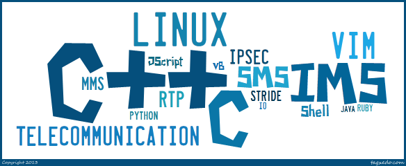

#俞凡
13918677360 yuff100@[163|hotmail|gmail].com

> -- 5年C/C++开发经验

> -- 5年产品级大型通信系统开发经验

> -- 1年小型团队管理经验

##个人信息
>性别：男

>出生年月：1982年1月

##项目经历
>Mavenir Systems：
>>2013/01至今：UAG
>>>设计/实现/测试/维护RTP媒体模块

>>>带领团队设计/实现/测试/维护MSRP/RTP(包括Slowpath和Fastpath)模块

>>2009/08 -- 2012/12：RMS
>>>设计/实现/测试/维护Call Control模块/SIP模块/CDR模块/

>>>负责Capacity test

>>2009/03 -- 2011/10：TAS/BSG
>>>测试/维护H248模块

>>>实现/测试/维护SIP模块

>>>设计/实现/测试/维护CDR模块

>>2008/05 -- 2009/08：IMS
>>>参与实现/测试/维护SIP模块

>>>设计/实现/测试/维护CDR模块

>>>负责Capacity test

>Motorola：
>>2007/10 -- 2008/05：WiMAX手机应用
>>>负责Review设计/开发文档

>>>设计/开发集成测试

>>2007/04 -- 2007/10：OMA PoC Based PTX Server
>>>设计/实现PTX Server主要架构及功能

>>>设计/实现用于测试的Client

>Motorola (Intern)：
>>2006/02 -- 2006/08：iDEN手机应用
>>>设计/开发/维护基于STRIDE/JScript的自动化手机测试脚本

>资源世代：
>>2005/09 -- 2006/02：SIP Server
>>>实现可提供VoIP/IVR/VoiceMail等功能的SIP Server

##工作经历
>2008/05至今:
>>迈韦尼通讯技术(上海)有限公司
>>>Software Engineer -- Senior Software Engineer -- Senior Technical Lead

>2007/04 -- 2008/05:
>>摩托罗拉(中国)公司南京软件中心
>>>Software Engineer

>2006/02 -- 2006/08：
>>摩托罗拉(中国)公司南京软件中心
>>>Intern Software Engineer

>2005/09 -- 2006/02:
>>资源世代通信(深圳)公司
>>>Part-time Software Engineer

##教育经历
>2004/09 -- 2007/04:
>>南京邮电大学
>>>计算机应用技术(计算机在通信中的应用) 硕士

>2000/09 -- 2004/07:
>>南京师范大学
>>>电子信息工程 本科

##培训经历
>2007/11:
>>ESI & The George Washington University
>>>Software Testing for Better Project Management

>2007/07：
>>Motorola University
>>>Effective Presentations

>2007/4 -- 2007/5：
>>Motorola University
>>>Motorola University ITP/RTP training
